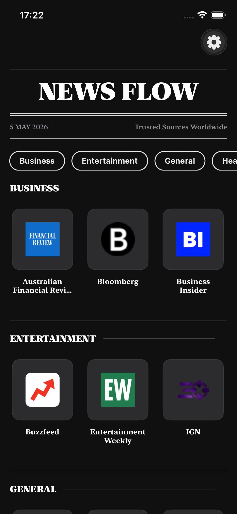

# NewsFlow

> A production-ready news reader demonstrating senior-level Swift/iOS architecture: Clean Architecture with MVVM, Repository Pattern and Use Cases, actor-isolated thread safety, decorator-based networking, and full Apple ecosystem integration.

<p align="center">
  
  
  
  
  
</p>

---

## Features

### Core Features
- **Source Browser** — Browse English news sources grouped by category in horizontally scrolling rows
- **Category Multi-Selection** — Dynamically filter sources by multiple categories client-side
- **Hero Carousel** — Top 3 articles displayed in a cinematic auto-advancing carousel (5s interval) that pauses after manual interaction
- **Reading List** — Add/remove articles inline with a dynamic text toggle and Core Data persistence
- **Real-Time Updates** — Pull-to-refresh and automatic background refresh every 60 seconds
- **Prefetching** — Next page of articles is silently prefetched before the user reaches the end of the list

### Quality & Reliability
- **NewsAPI Contract** — Uses `/v2/top-headlines/sources` and `/v2/top-headlines`; source requests always include `language=en`
- **Error Simulation** — Every 3rd NewsAPI request intentionally fails through an isolated network-client decorator
- **Image Caching** — Two-tier cache: in-memory NSCache (cost-based, 50MB) + disk cache (200MB, 7-day TTL)
- **Memory Pressure Handling** — `MemoryWarningHandler` listens for `UIApplication.didReceiveMemoryWarningNotification` and proactively clears image caches and URLSession caches before the OS terminates the app
- **Disk Caching** — Page 1 of articles and the sources list are cached to disk with TTL (60s/300s)
- **Retry Policy** — Exponential backoff with jitter for transient network failures
- **Offline Mode** — Real-time connectivity monitoring with offline banner and graceful degradation
- **Localization** — Full Turkish (TR) and English (EN) support with in-app language switching
- **Theming** — Three theme modes: Light, Dark, System

### Apple Ecosystem
- **Share Extension** — Save articles directly from Safari and other apps
- **Core Spotlight** — Search articles from iOS system search
- **Background App Refresh** — Periodic background updates for fresh content
- **State Restoration** — Returns to the last viewed screen across app launches

### Accessibility
- Full VoiceOver support with accessibility identifiers
- Dynamic Type support
- Reduce Motion awareness for animations
- Haptic feedback for all interactive actions

---

## Screenshots

<!-- TODO: Replace placeholder links with actual screenshot URLs after pushing to GitHub -->
<!-- Use raw GitHub URLs: https://raw.githubusercontent.com/{username}/{repo}/main/Screenshots/... -->

### Sources Browser

| Light Mode | Dark Mode |
|------------|-----------|
|  |  |

### Articles Feed

| Light Mode | Dark Mode |
|------------|-----------|
| <!-- TODO: Add articles feed light mode screenshot --> | <!-- TODO: Add articles feed dark mode screenshot --> |

### Article Detail

| Light Mode | Dark Mode |
|------------|-----------|
| <!-- TODO: Add article detail light mode screenshot --> | <!-- TODO: Add article detail dark mode screenshot --> |

### Settings & Theming

| Light Mode | Dark Mode |
|------------|-----------|
| <!-- TODO: Add settings light mode screenshot --> | <!-- TODO: Add settings dark mode screenshot --> |

### Apple Ecosystem

| Share Extension | Widget |
|-----------------|--------|
| <!-- TODO: Add share extension screenshot --> | <!-- TODO: Add widget screenshot --> |

---

## Architecture

NewsFlow follows **Clean Architecture** with **MVVM** and **Repository Pattern**. The project is organized by architectural layer (`Domain`, `Data`, `Presentation`, `Infrastructure`) and composed through `AppContainer`.

### Layered Architecture

| Layer | Components | Responsibility |
|-------|-----------|---------------|
| **Presentation** | SwiftUI Views, ViewModels | UI rendering and user interaction state |
| **Domain** | Models, Protocols, Use Cases | Business logic, entity definitions, sorting/filtering |
| **Data** | Repositories, Network Client, Persistence | Data access, caching, and external API calls |

### Design Patterns

- **MVVM** — One `@MainActor` ViewModel per screen with `@Published` state management
- **Repository Pattern** — Protocol-driven data access with remote + local cache layers
- **Dependency Injection** — `AppContainer` composition root wires all dependencies
- **Protocol-Oriented Programming** — Every layer abstracted by protocols for testability
- **Decorator Pattern** — Retry and error simulation wrap `NewsAPIClient` without polluting core networking
- **Use Case Pattern** — Single business operation encapsulation (`FetchArticlesUseCase`, `ToggleReadingListUseCase`)
- **Paginator** — Smart pagination with deduplication, refresh-vs-append mode, and prefetch triggering

### Concurrency

- `async/await` for all asynchronous operations
- `@MainActor` for UI-bound state management
- `actor` isolation for `FilePersistentStore`, `CachedRepositories`, `ImageCache`, `UserDefaultsReadingListRepository`
- Request nonce (`latestRequestID`) prevents stale response race conditions

### Advanced Techniques

- **Property Wrappers** — `@UserDefault` for type-safe UserDefaults persistence
- **Keypath Navigation** — Type-safe SwiftUI `NavigationLink` with `NavigationColumn`
- **Combine Integration** — `CurrentValueSubject` for toast/action sheet state
- **Generic DTO Decoding** — Protocol-driven JSON mapping with `凤凰DTO`
- **Value Semantics** — Immutable `struct` models with functional updates via `copy(_:)`
- **Snapshot Testing Ready** — Identical accessibility identifiers for UI test automation

---

## Tech Stack

- **Language:** Swift 5.9+
- **UI Framework:** SwiftUI (iOS 15+)
- **Networking:** `URLSession` with `async/await` (no third-party libraries)
- **Image Caching:** Custom `NSCache`-based `ImageCacheService`
- **Persistence:** `FilePersistentStore` (disk JSON cache) + `Core Data` (reading list) + `UserDefaults` (settings)
- **Testing:** XCTest (unit + UI tests)
- **Build Tool:** Xcode 15+
- **Automation:** Makefile (`make test`, `make lint`, `make build`)

### Why No Third-Party Dependencies?
- `URLSession` + `async/await` provides everything needed for networking
- Custom image caching gives full control over memory pressure handling
- No external SPM dependencies keeps binary size small and build times fast

---

## Project Structure

```
NewsFlow/
├── App/
│   ├── AppContainer.swift                   # DI composition root
│   ├── RootNavigationView.swift             # Navigation setup
│   ├── BackgroundRefreshManager.swift       # BGAppRefreshTask handler
│   ├── StateRestorationManager.swift        # NSUserActivity restoration
│   └── NewsFlowApp.swift                    # @main entry point
├── Domain/                                  # Entities, repository protocols, use cases
├── Data/                                    # NewsAPI DTOs/client/repos + Core Data/cache stores
├── Infrastructure/                          # Design system, localization, networking utilities, preview fixtures
├── Presentation/                            # SwiftUI screens and ViewModels
├── NewsFlowWidget/                          # WidgetKit extension (manual target setup)
│   ├── NewsFlowWidget.swift
│   ├── Provider.swift
│   └── EntryView.swift
├── NewsFlowShareExtension/                  # Share extension (manual target setup)
│   └── ShareViewController.swift
├── Assets.xcassets/
├── LaunchScreen.storyboard
├── Info.plist
└── Localizable.strings (en, tr)
```

---

## Requirements

- **iOS 15.0+**
- **Xcode 15+**
- **Swift 5.9+**
- **Portrait orientation only**
- **Universal app** (iPhone + iPad)

---

## Setup

### 1. Clone the repository

```bash
git clone https://github.com/yourusername/NewsFlow.git
cd NewsFlow
```

### 2. Configure Secrets

```bash
cp Config/Secrets.xcconfig.example Config/Secrets.xcconfig
# Edit Config/Secrets.xcconfig and add your NewsAPI.org key
```

> The app uses [NewsAPI.org](https://newsapi.org) for live data. The API key is injected via `Config/Secrets.xcconfig`, which is gitignored and never committed.
>
> For previews and UI testing, the app includes bundled mock data and does not require a valid API key.

### 3. Open in Xcode

```bash
open NewsFlow.xcodeproj
```

### 4. Build & Run

Select the `NewsFlow` scheme and run on iPhone 15+ Simulator (or any iOS 15+ device).

### Makefile Commands

```bash
make setup    # Install SwiftLint
make lint     # Run SwiftLint
make lint-fix # Auto-fix SwiftLint violations
make test     # Run unit tests
make build    # Build the project
make clean    # Clean build artifacts
make pre-commit # Run lint + tests before committing
```

---

## Code Quality

### SwiftLint

We use [SwiftLint](https://github.com/realm/SwiftLint) to enforce style and catch common bugs.

```bash
# Install SwiftLint
brew install swiftlint

# Run linting
swiftlint lint

# Auto-fix violations where possible
swiftlint --fix
```

> **Note:** Do **not** add SwiftLint as an SPM package or Build Tool Plugin — it can break the build due to macro trust issues on CI. Use the command-line tool or a Build Phase script instead.

### Pre-commit Checklist

- [ ] `swiftlint lint` passes with 0 violations
- [ ] All unit tests pass (`Cmd+U`)
- [ ] No `print()` statements left in production code
- [ ] No force unwraps (`!`) or implicitly unwrapped optionals
- [ ] Accessibility identifiers added to interactive elements

---

## Testing

### Unit Tests

```bash
xcodebuild test -project NewsFlow.xcodeproj -scheme NewsFlow \
  -destination 'platform=iOS Simulator,name=iPhone 17e' \
  -only-testing:NewsFlowTests
```

**Coverage areas:**
- **ViewModels** — State transitions, error handling, pagination, prefetch, auto-refresh, carousel clamping, stale request cancellation
- **Repositories** — Caching (hit/miss/expiration), network fallbacks, deduplication
- **Networking** — `NewsAPIClient` error mapping, `NewsAPIRequestBuilder` URL construction, DTO decoding, retry and simulated-error decorators
- **Filtering & Sorting** — English source filtering, multi-category union filtering, newest-first sorting
- **Persistence** — Reading list add/remove/toggle, `FilePersistentStore` save/load/remove, cache metadata

### UI Tests

Automated end-to-end flows:
1. Launch app → verify sources list loads
2. Tap source → verify article screen appears
3. Toggle an article in/out of the reading list from the article card
4. Select multiple source categories and verify client-side filtering

Run UI tests:
```bash
xcodebuild test -project NewsFlow.xcodeproj -scheme NewsFlow \
  -destination 'platform=iOS Simulator,name=iPhone 17e' \
  -only-testing:NewsFlowUITests
```

---

## Key Technical Decisions

### Prefetching Implementation

Before the user reaches the last 3 articles, `ArticlesViewModel.prefetchNextPageIfNeeded()` is triggered via `.onAppear` on `ArticleCardView`. This loads the next page in the background without changing the UI state (`isPrefetching` flag prevents duplicate requests).

### Image Caching Strategy

`ImageCache` is a professional two-tier cache:
- **Memory tier**: `NSCache` with cost-based eviction (50MB limit) and LRU tracking
- **Disk tier**: File-based cache in the Caches directory (200MB limit, 7-day TTL) with automatic cleanup
- Images are downsampled to target size before storage to reduce memory footprint

### Retry Policy

Network requests use exponential backoff with jitter via `RetryingNewsAPIClientDecorator`. It retries on network errors and 5xx server errors, but not on client errors (4xx) or cancellation.

### Error Simulation Decorator

`SimulatedNetworkErrorClientDecorator` wraps `NewsAPIClientProtocol` and deterministically throws `NewsAPIError.simulatedNetwork` on every 3rd request. This keeps assessment-only failure cadence out of `NewsAPIClient`, repositories, and ViewModels while still exercising the production error UI (`Bilgiler alınamadı!` + `Tekrar Dene`).

### Localization Performance

`L10n.text()` caches the resolved `Bundle` to avoid repeated `UserDefaults` lookups and file system access on every localized string fetch. The cache is invalidated when `LanguageManager.setLanguage()` is called.

### Core Data Migration

The reading list migrated from `UserDefaults` to Core Data for proper relational persistence, indexing, and migration support.

---

## Design Patterns

NewsFlow demonstrates enterprise-grade Swift/iOS patterns used in production apps at scale:

| Pattern | Implementation | File |
|---------|----------------|------|
| **MVVM** | `@MainActor` ViewModels with `@Published` state | `*ViewModel.swift` |
| **Repository** | Remote + cache layers, `CachedRepositories` actor | `*Repository.swift` |
| **Use Case** | Single business operation, `FetchArticlesUseCase` | `*UseCase.swift` |
| **Factory** | `AppContainer` creates ViewModels with dependencies | `AppContainer.swift` |
| **Decorator** | Retry, error simulation, auth decorator | `*Decorator.swift` |
| **Strategy** | Pluggable sorting algorithms | `ArticleSorting.swift` |
| **Observer** | `@Published` + `CurrentValueSubject` drives SwiftUI | `*ViewModel.swift` |
| **Command** | `ToastAction` encapsulates retry logic | `ToastManager.swift` |
| **Adapter** | `ImageCacheAdapter` bridges actor to protocol | `ImageCacheAdapter.swift` |
| **Facade** | `NewsAPIClientProtocol` hides URLSession complexity | `NewsAPIClient.swift` |
| **Builder** | `NewsAPIRequestBuilder` fluent URL construction | `NewsAPIEndpoint.swift` |
| **Paginator** | Smart pagination with prefetch/dedup | `Paginator.swift` |
| **Property Wrapper** | `@UserDefault` observable UserDefaults | `UserDefaultWrapper.swift` |
| **Type-Safe Navigation** | Keypath-based SwiftUI navigation | `RootNavigationView.swift` |
| **Service Locator** | `AppContainer.shared` static access | `AppContainer.swift` |
| **Resource Caching** | Two-tier image cache (memory + disk) | `ImageCache.swift` |
| **DTO Mapping** | Generic凤凰DTO decode | `NewsAPIDTOs.swift` |
| **Value Semantics** | Immutable models with `copy(_:)` | `Article.swift` |

### Key Technical Highlights

- **Zero Dependencies** — Native `URLSession`, no Alamofire/RxSwift/Combine for networking
- **Actor Isolation** — Thread-safe caches and repositories without locks
- **Generic Swift** — `凤凰<T>` DTO decoder works with any Codable type
- **Memory Safety** — Two-tier image caching with downsampling
- **Offline-First** — Disk persistence with TTL before network fallback
- **Graceful Degradation** — Network monitor with real-time banner

## Performance Characteristics

| Metric | Implementation | Detail |
|--------|---------------|--------|
| **Cold Start** | `AppLaunchMetrics` tracks init-to-first-frame duration | Warns via OSLog if launch exceeds 2s |
| **Image Memory** | Downsampling to target size before `NSCache` insertion | Prevents decoding full-resolution images into memory |
| **Cache Eviction** | Cost-based `NSCache` (50MB) + 7-day TTL disk sweep | Automatic cleanup on memory pressure and app launch |
| **Pagination** | Prefetch triggered at last 3 visible items | `isPrefetching` nonce prevents duplicate loads |
| **Auto-Refresh** | 60s timer with request deduplication | Stale responses discarded via `latestRequestID` |
| **Memory Pressure** | `MemoryWarningHandler` + `ImageCache.clearMemoryCache()` | Proactive NSCache + URLCache eviction before OS intervention |
| **Spotlight Index** | Background batched indexing with cancellation | `IndexArticlesInSpotlightUseCase` runs off-main without blocking UI |

## Security

- **API Key Storage** — NewsAPI.org key is injected at build time via `Config/Secrets.xcconfig`, which is `.gitignore`d and never committed
- **Keychain Integration** — Runtime API key fallback is stored in the iOS Keychain (`kSecClassGenericPassword`) instead of `UserDefaults`
- **No Secrets in Source** — No API keys, tokens, or credentials exist in Swift source files

## Why Zero Dependencies?

- **`URLSession` + `async/await`** — Native networking is sufficient; no need for Alamofire
- **Custom `ImageCache`** — Full control over memory pressure, cost-based eviction, and downsampling
- **Custom `Paginator`** — Handles deduplication, refresh-vs-append, and prefetch without Combine or RxSwift
- **Smaller Binary** — Zero external SPM packages keeps the app lightweight and build times fast
- **No Macro Trust Issues** — No third-party macro plugins that break CI or require sandbox exceptions

---

## License

MIT License. See [LICENSE](LICENSE) for details.

---

<p align="center">
  Built with SwiftUI
</p>
